##  

<br>
<center>
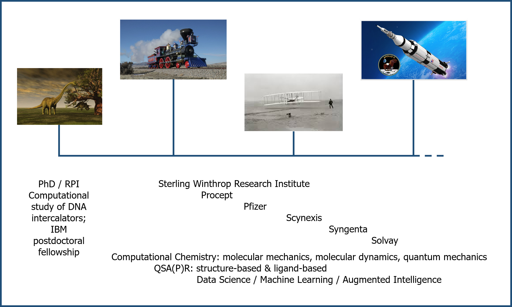
</center>

# Cheminformatics

<h5 align='right'><small><https://www.nature.com/subjects/cheminformatics></small></h5>

Cheminformatics is the use of computational and informational techniques to understand problems of chemistry.  

<h5 align='right'><small><https://www.acs.org/content/acs/en/careers/college-to-career/chemistry-careers/cheminformatics.html></small></h5>

- Develop <font color = 'red'>methods for data mining</font> and performing statistical analysis of large datasets  
- Develop <font color = 'red'>methods for archiving and retrieving data</font> on molecular structures, reaction pathways, molecular interactions, or other phenomena  
- Collaborate with laboratory researchers to <font color = 'red'>solve problems using data searching and retrieval</font>  
- Collaborate with researchers in various fields to <font color = 'red'>integrate information from a variety of disciplines and sources</font>  
- <font color = 'red'>Identify chemical</font> property classifications and <font color = 'red'>trends</font> from large databases using mathematical techniques  

##  

<center>
<h1> Chemistry </h1>
<h1> \+ Machine Learning </h1>
<h1> \+ Data Mining </h1>
<h1> \+ Data Curation </h1>
<hr width="42%">
<h1> Cheminformatics </h1>
</center>

# Machine Learning Workflows

<font size="4">
<h2><b>CR</b>oss-<b>I</b>ndustry <b>S</b>tandard <b>P</b>rocess for <b>D</b>ata <b>M</b>ining</h2>
</font>
<center>

</center>

##
<h2>R for Data Science</h2>
<font size="4">
<h2>H. Wickham \& G. Grolemund; <b>ISBN-13:</b> 978-1491910399</h2>
</font>
<center>
<br><br><br><br>

</center>

##
<h2>R in Action</h2>
<center>

</center>

##

<h2>Constructing a Cheminformatics Predictor</h2>
<h5>X. Yang, \&c., <i>Chem. Rev.</i> 2019, <b>119</b>, 10520-10594.</h5>
<center>
<br><br>
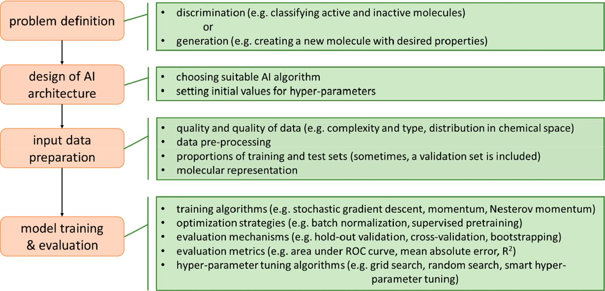
</center>

##

<h2>Boston Housing Data...</h2>
<center>
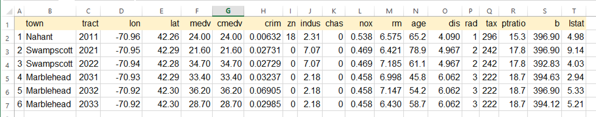
</center>

##

<h2>...compared to a representative cheminformatics dataset</h2>
<center>
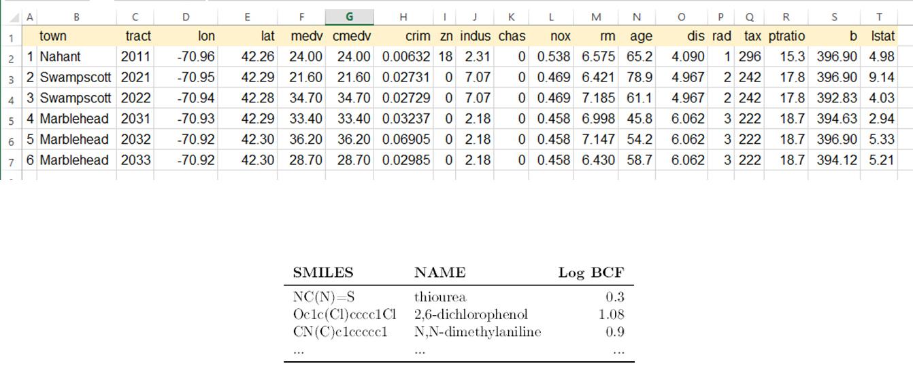
</center>

# In the beginning ...

```{r hansch, echo=FALSE, out.width = '60%', fig.align = 'center'}
knitr::include_graphics("images/Hansch.png")
```  

<small>C. Hansch & T. Fujita, *J. Am. Chem. Soc.* 1964, **86**(8), 1616-1626.</small>

# Topics

- Representing molecules  
- Calculating features & fingerprints  
- Similarity  
- QSAR & QSPR: regression & classification  
- Structure alerts    
- Read across  
- Network analysis  

# Representing Molecules

<center>

</center>

<font size="4">
Canonical SMILES:<br>
<b>C[C@@H]1CC[C@H]2[C@@H](C)C(=O)O[C@@H]3O[C@]4(C)CC[C@@H]1[C@@]23OO4</b>
<br>
Standard InChI: <br>
<b>InChI=1S/C15H22O5/c1-8-4-5-11-9(2)12(16)17-13-15(11)10(8)6-7-14(3,18-13)19-20-15/h8-11,13H,4-7H2,1-3H3/t8-,9-,10+,11+,13-,14+,15-/m1/s1</b> 
<br>
Standard InChI Key: <br>
<b>BLUAFEHZUWYNDE-DKGJTOOQSA-N</b> 
<br><br>
InChI = <font color='red' size="4">In</font>ternational <font color='red' size="4">Ch</font>emical <font color='red' size="4">I</font>dentifier</font>
</font>


## Artemisinin (CHEMBL567597) SDFile

<font size="3">
<pre>
  SciTegic01161211242D

 23 26  0  0  0  0            999 V2000
    8.9610  -14.2763    0.0000 C   0  0
    9.7561  -14.0715    0.0000 C   0  0
    8.6232  -15.0326    0.0000 C   0  0  2  0  0  0
    9.0079  -15.7655    0.0000 O   0  0
   10.4145  -14.5618    0.0000 C   0  0  1  0  0  0
   11.8718  -15.3337    0.0000 C   0  0
   11.8411  -14.5088    0.0000 C   0  0
   11.1102  -14.1227    0.0000 C   0  0  1  0  0  0
   11.1714  -15.7725    0.0000 C   0  0  2  0  0  0
   10.4429  -15.3836    0.0000 C   0  0  1  0  0  0
    9.7513  -15.8203    0.0000 C   0  0  2  0  0  0
    9.7780  -16.6436    0.0000 O   0  0
   10.5025  -17.0284    0.0000 C   0  0
   11.2043  -16.5940    0.0000 C   0  0  2  0  0  0
    7.7986  -15.0587    0.0000 C   0  0
    9.6477  -15.2738    0.0000 O   0  0
    9.3989  -14.4902    0.0000 O   0  0
   10.4064  -13.7357    0.0000 H   0  0
   11.8824  -16.1817    0.0000 H   0  0
   10.5348  -17.8530    0.0000 O   0  0
    9.1585  -16.3974    0.0000 H   0  0
   11.0783  -13.2983    0.0000 C   0  0
   11.9339  -16.9781    0.0000 C   0  0
  2  5  1  0
  1  3  1  0
  9 14  1  0
 10 11  1  0
 11 12  1  0
 13 12  1  0
 13 14  1  0
  1  2  1  0
  3 15  1  1
  5  8  1  0
 10 16  1  6
  9  6  1  0
 16 17  1  0
  3 17  1  0
  6  7  1  0
  5 18  1  6
  7  8  1  0
  9 19  1  6
  9 10  1  0
 13 20  2  0
  3  4  1  0
 11 21  1  1
  4 11  1  0
  8 22  1  6
  5 10  1  0
 14 23  1  1
M  END
> <chembl_id>
CHEMBL567597
</pre>
</font>

# Calculating fingerprints

<center>

</center>

# Calculating features  

<center>

</center>

##

<center>
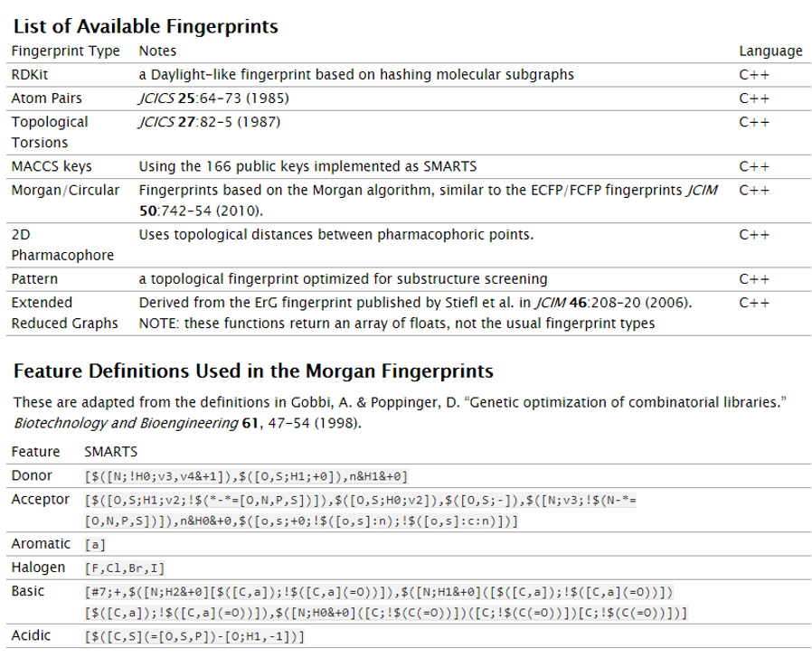
</center>

# Similarity  

<font color = 'blue'>similar property principle</font>: structurally similar molecules tend to have similar properties  

<center>

</center>  

## Similarity measures  

Tanimoto coefficient ($T_{c}$):

$$T_{c} = \frac{c}{a + b - c}$$  
  a = bits set in molecule A  
  b = bits set in molecule B  
  c = bits set in *both* molecules A and B  
  
<center>

</center>
  
## Similarity searching  
<br><br>
Originally developed as a complement to substructure searching  

* no need for a detailed pharmacophore  
* control over volume of output  

<br><br>
Rapidly adopted, both efficient and effective; basic ideas extended to other applications  

* cluster analysis  
* molecular diversity analysis  

## Diversity analysis  

* Similarity is a property of a pair of molecules; diversity is a property of a set of molecules  
* Idea of choosing a representative subset from a large database, *e.g.*, for biological testing  
* Typical algorithm to select a set of dissimilar (*e.g.*, 1-Tanimoto) molecules from a database: 

  1. Select a molecule and place it in a subset  
  2. Calculate dissimilarity between each remaining molecule and the subset molecules  
  3. Choose next molecule that is most dissimilar to the subset molecules  
  4. If less than *n* subset molecules then return to 2


# QSAR & QSPR: regression & classification  

To successfully apply machine learning, one needs  

* a large data set of molecules,  
* a molecular encoding,  
* a label per molecule in the data set, and  
* an algorithm to train a model.  

Then, one can make predictions for new molecules.

## 

<center>
Stamford slide deck [34 - 56]  

C>>Users>>us16120>>Projects>>Stamford
</center>

# SHAP (<font color = 'red'>SH</font>apley <font color = 'red'>A</font>dditive ex<font color = 'red'>P</font>lanations) analysis  

* originally developed to estimate the importance of an individual player in a collaborative team  
* meant to distribute total gain or payoff among players, depending on the relative importance of their contributions  
* Shapley values can also be rationalized as a fair or reasonable allocation of feature importance given a particular model output  
* Shapley values represent estimates of feature importance (magnitude of the contribution)
as well as the direction (sign)  
* features with positive sign contribute to the prediction of activity, whereas features with
negative sign contribute to the prediction of inactivity (*i.e.*, negative contribution to activity prediction)  

## Comparative interpretation  

<br><br>

<center>
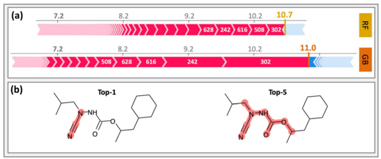
</center>  

* red = positive feature contribution; blue = negative feature contribution  
* white numbers refer to top-ranked features  
* the top-1 and the top-5 features are mapped 

## Interpretation of activity predictions  

<br>

<center>
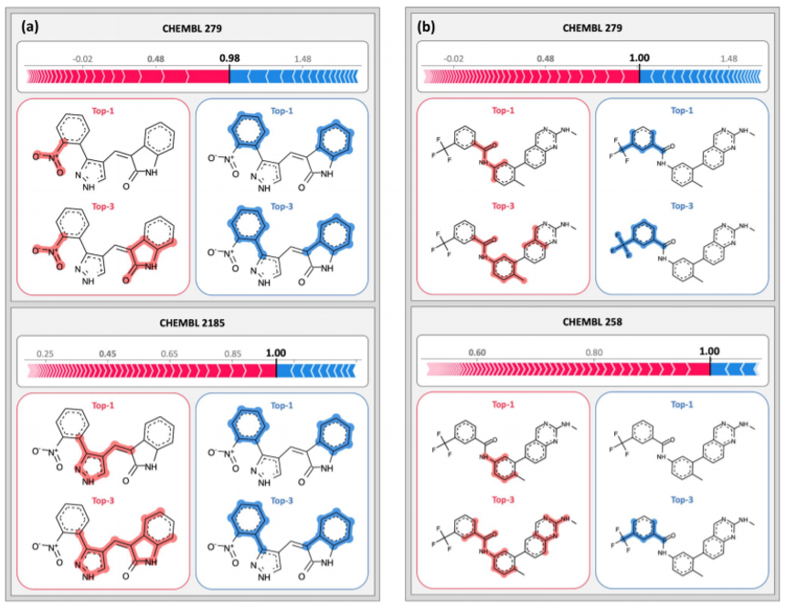
</center>

# SALI (<font color = 'red'>S</font>tructure-<font color = 'red'>A</font>ctivity <font color = 'red'>L</font>andscape <font color = 'red'>I</font>ndex)  

<br>  

* a simple means of identifying pairs of compounds where small changes in chemical structure brings about a large change in biological activity or physical properties  
* these changes often identify parts of the molecule that are most important for activity  
* plan synthetic targets including / excluding these parts of the molecule  

<br>  

$$SALI_{i,j} = \frac{|A_{i} - A_{j}|}{1 - sim(i,j)}$$

## Readily (!?) identify trends ...  

<center>
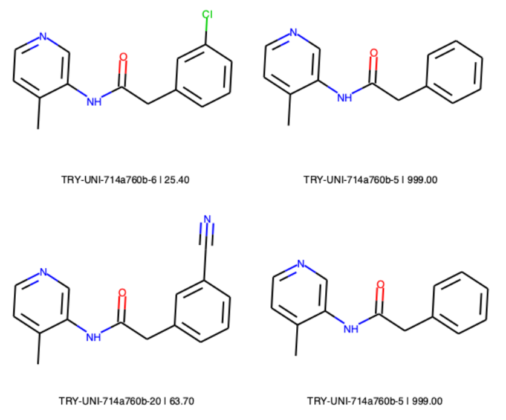
</center>

## ... cut-and-paste from a Jupyter notebook

<br>  

<center>
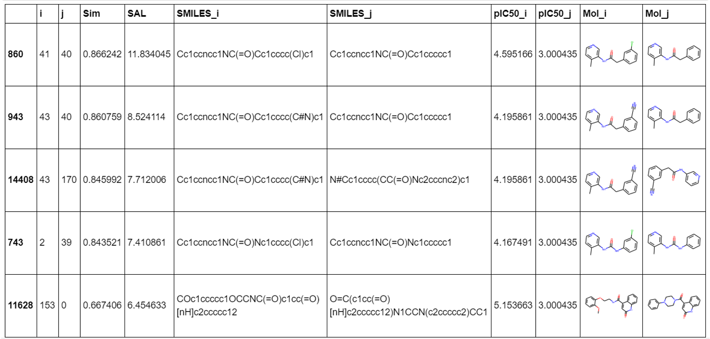
</center>

# Matched Molecular Pairs  

Matched molecular pair analysis (MMPA) enables the automated and systematic compilation of medicinal chemistry rules from compound/property data sets.  

The overall process is:  

1. Fragment structures in a SMILES file, to produce fragments.  

2. Index the fragments to produces matched molecular pairs. (you might include property information at this point)  

3. Load property information.  

4. Find transforms for a given structure; and/or  

5. Predict a property for a structure given the known property for another structure

## Identify pairs

<center>

</center>

## Workflow schematic  

<center>
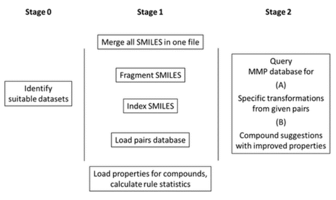
</center>

## Building rule sets  

<center>

</center>

## MMP GUI 

<br>  

<center>
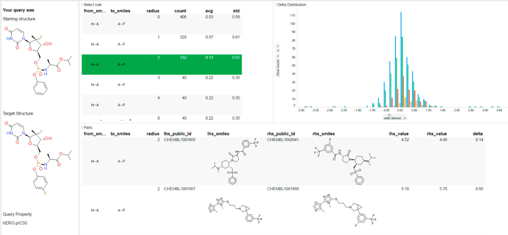
</center>

# Never enough time ...  

* Maximum Common Substructure  
* Structure alerts   
* Read across  
* Network analysis

# It's about ...

<padding text-align = 'center'>
<br><br><br><br>
<h2><font color = 'blue'>"Data! data! data!"</font> he cried impatiently. <br> "I can't make bricks without clay."</h2>
<h4 align='right'>The Adventures of the Copper Beeches</h4>
<h4 align='right'>Sir Arthur Conan Doyle</h4>
</padding>